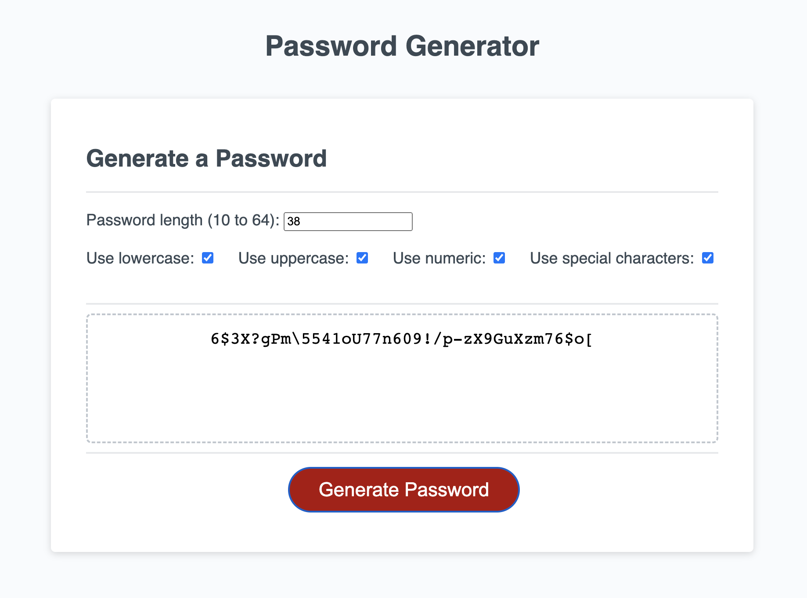

# Password Generator

## Description
JavaScript application that generates random passwords with length between 10 to 64 characters and can include different types of them: lowercase, uppercase, numeric and special characters.

## Final result

## Installation
"N/A"

## Usage
 1. Follow the link to open deployed application
 2. Enter the number of characters you would like to contain your password (the length of password has to be **10 to 64 characters**)  
 3. Click on checkboxes to select character types. **At least one type of characters has to be selected**
 4. Press the red button "Generate Password"
 5. Enjoy your secure password 

## License
MIT license

